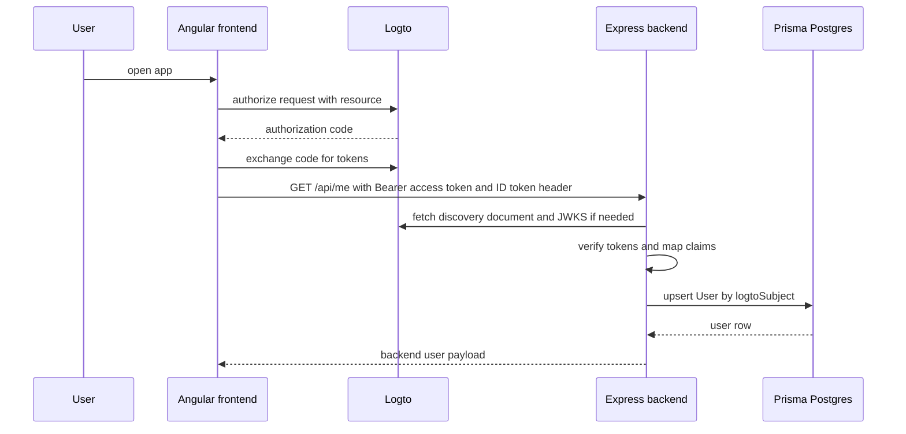

# Architecture

Scryflemme is a monorepo with four relevant areas:

- `apps/frontend`: Angular UI and login entry point
- `apps/backend`: Express API and identity authority
- `apps/types`: shared API contracts between both apps
- `docs/`: the documentation workspace

## Request Flow

The frontend renders the UI, acquires Logto tokens, and calls the backend for data.

The backend:

- verifies the access token
- verifies the ID token when present
- reads the Logto subject
- upserts a local user record
- serves API data from Prisma

## Runtime Responsibilities

### Frontend

The Angular app is responsible for presentation and session UX.

It:

- starts the Logto login flow
- receives the callback
- stores and renews the browser tokens
- attaches tokens to `/api/*` requests
- renders authenticated state from the backend

### Backend

The Express app owns application identity and data access.

It:

- validates incoming bearer tokens
- maps the Logto subject to a local user row
- fills `email` and `name` from the verified ID token when available
- exposes backend-owned API responses such as `/api/me`

### Shared Types

`apps/types` is the contract boundary.

Use it for:

- API payload shapes
- data-transfer types shared by frontend and backend
- avoiding duplicated response contracts

## Workspace Map

| Path | Responsibility |
| --- | --- |
| `apps/frontend/src/app/app.config.ts` | OIDC configuration and HTTP interception |
| `apps/frontend/src/app/features/auth/data-access/session-api.service.ts` | Backend `/api/me` client |
| `apps/frontend/src/app/features/profile/pages/profile-page/profile-page.component.ts` | Displays backend-linked account state |
| `apps/backend/src/app.ts` | Express routes |
| `apps/backend/src/auth/logto.ts` | Token verification and user upsert |
| `apps/backend/prisma/schema.prisma` | Domain model |
| `apps/backend/prisma/seed.ts` | Catalog seeding |

## Design Principle

The backend is the source of truth for application identity and data access.

The frontend only:

- starts login
- sends tokens to the backend
- renders the authenticated state returned by the backend

This prevents the browser from becoming the authority on who the user is.

## Request Ownership

| Concern | Owner |
| --- | --- |
| Login initiation | Frontend |
| Token verification | Backend |
| User creation | Backend |
| Local profile fields | Backend |
| Card catalog browsing | Backend |
| UI state and routing | Frontend |
