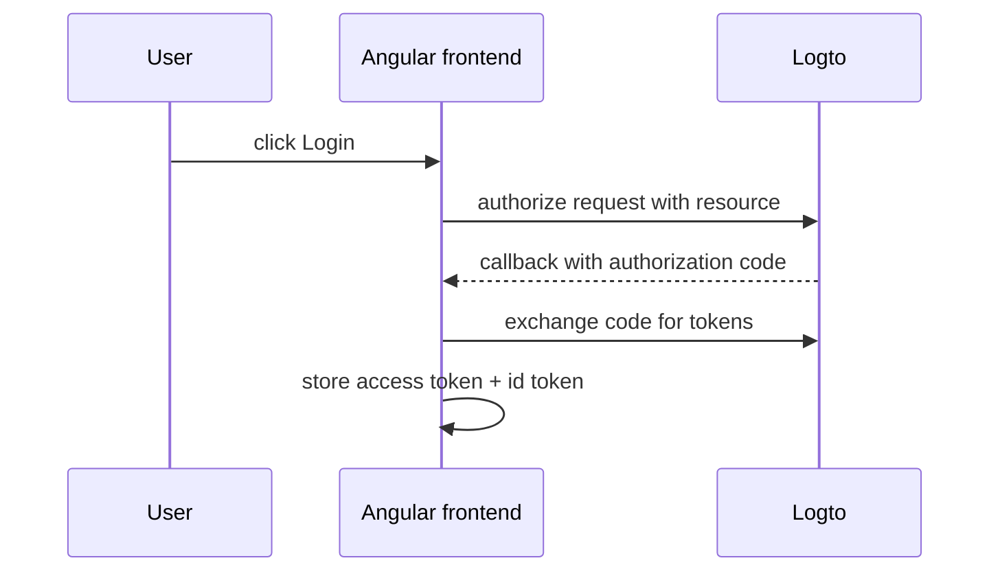
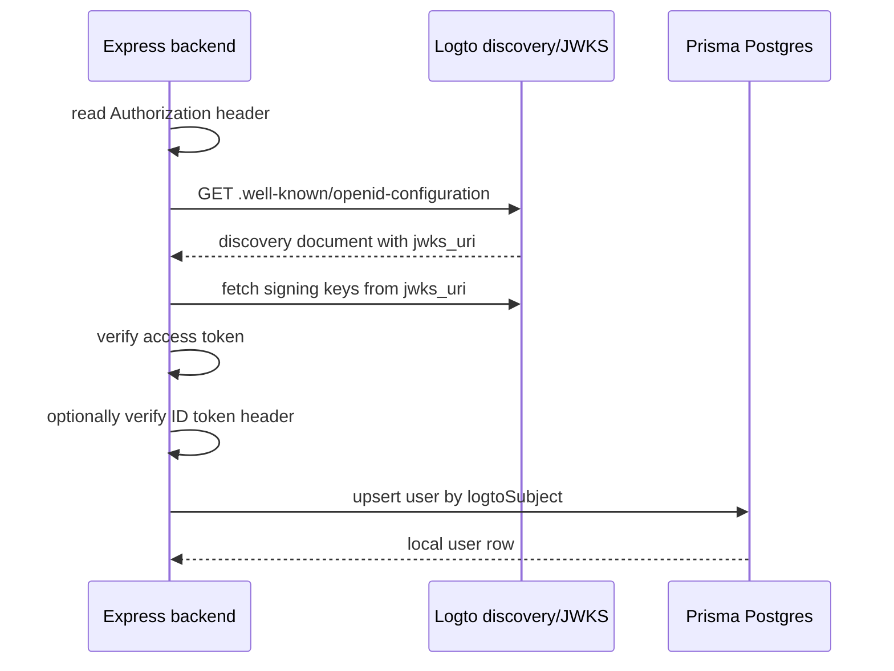

# Authentication

Authentication is a split responsibility:

- the frontend handles the redirect-based OIDC flow
- the backend decides whether the request is authorized and which local user it maps to

## Token Contract

The frontend sends two tokens on `/api/*` requests:

- `Authorization: Bearer <access token>`
- `X-Logto-Id-Token: <id token>`

The access token is used to authorize the request to the backend API.
The ID token is used to hydrate the local user profile fields.

## Frontend Flow

The Angular configuration in `apps/frontend/src/app/app.config.ts` does the following:

- points at the Logto authority
- requests the backend API resource
- disables automatic userinfo calls
- uses the library initializer so callback handling completes before the app keeps going
- installs an HTTP interceptor that adds tokens to `/api/*` requests

## Backend Flow

`apps/backend/src/auth/logto.ts` performs the following:

1. Extract the bearer token from `Authorization`
2. Load Logto discovery metadata
3. Resolve the JWKS URI from discovery
4. Verify the access token signature and issuer
5. Check the audience
6. Optionally verify the ID token from `X-Logto-Id-Token`
7. Merge identity claims into a local `User`
8. Upsert the user by `logtoSubject`

## Identity Mapping

The stable key is `sub` from the verified token.

The backend uses these claims when available:

- `sub` -> `logtoSubject`
- `email` -> `email`
- `name` -> `name`
- `preferred_username` -> fallback for `name`

If a claim is missing, the backend keeps the local field `null`.

## Why This Is Structured This Way

The backend is trusted because it can verify tokens and control persistence.

That gives you:

- a stable local `User` row
- a clean place to add authorization checks later
- a single canonical user source for the rest of the app

It also means the frontend should never be treated as the source of identity truth.

## Common Failure Modes

If login works but `/api/me` fails, check these first:

- the frontend is requesting the correct `resource`
- the browser request actually has the bearer token header
- the backend `LOGTO_ISSUER` matches the tenant
- the backend `LOGTO_AUDIENCE` matches the API resource identifier
- Logto has been configured with that API resource

If the user row is created but `email` and `name` are empty, then the verified ID token does not contain those claims for that account.
