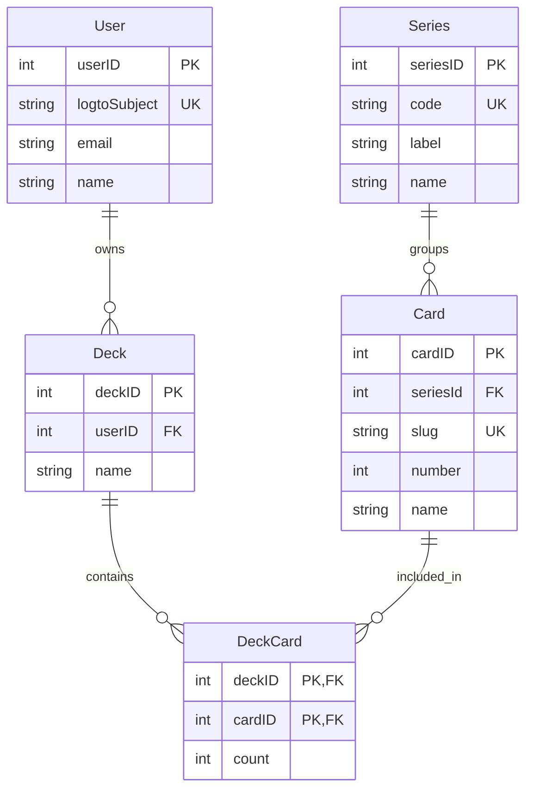

# Data Model

The backend uses Prisma/Postgres for the domain model.

## Core Models

| Model | Purpose |
| --- | --- |
| `Series` | Card set metadata |
| `Card` | Catalog entries displayed in the browser |
| `User` | Authenticated application user linked to Logto |
| `Deck` | User-owned deck container |
| `DeckCard` | Join table for deck contents |

## Identity Model

`User.logtoSubject` is the stable identity key from Logto.

It is unique and is the field the backend uses to upsert the application user.

`email` and `name` are optional profile fields.
They are hydrated from the verified Logto ID token when possible.

## Seeded Catalog

The card catalog is seeded from `apps/backend/prisma/seed.json` through `apps/backend/prisma/seed.ts`.

The seed process:

- creates or updates each `Series`
- creates or updates each `Card`
- preserves the catalog shape expected by the frontend browser

## Important Invariants

- `Series.code` is unique and is the canonical set code.
- `Card.slug` is unique and stable.
- `User.logtoSubject` is the stable identity link from Logto.
- `Deck` is unique per `(userID, name)`.
- `DeckCard` is unique per `(deckID, cardID)`.

## Practical Consequence

If you change identity logic, change the `User` model and the auth code together.

If you change catalog structure, update the seed script and the browser page together.
