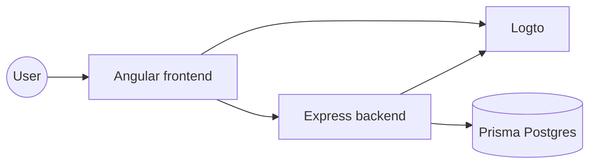

# Scryflemme Documentation

This docs workspace is the system map for the repo.

It should answer four questions quickly:

1. What runs where?
2. How does a request move through the stack?
3. Where does identity live?
4. Which parts are deliberately owned by the backend versus the frontend?

## At A Glance

## What To Read First

- [architecture](./architecture) for the system layout and main request paths
- [authentication](./authentication) for the Logto flow and token contract
- [data-model](./data-model) for Prisma ownership and the user mapping rules
- [api](./api) for the current backend endpoints
- [roadmap](./roadmap) for the next planned areas of work
- [local-development](./local-development) for setup and everyday commands

## Scope

This documentation is intentionally operational:

- it explains the current code, not a theoretical target state
- it favors concrete request and data flows over high-level marketing language
- it records assumptions the code relies on, especially around auth and identity
